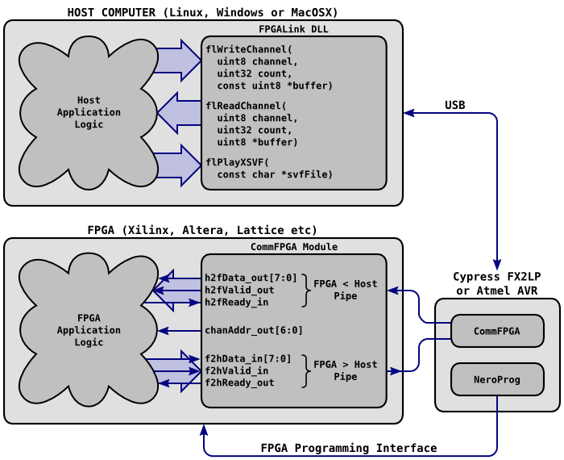

FPGALINK USER MANUAL
********************

The aim of the FPGALink project is to provide a hardware abstraction layer for hardware involving an FPGA connected to a computer over USB, to abstract core functionality like FPGA-programming and subsequent host-FPGA communication. The result is that you only have to learn how to use one set of tools, APIs and HDL interfaces because that knowledge is transferrable to many different host platforms and many different commercial FPGA development kits.

Contents
========

.. toctree::
   :maxdepth: 2

   introduction
   installation
