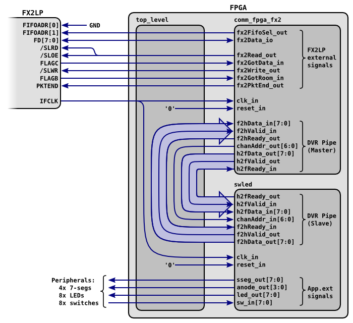

INSTALLATION
************

Linux Installation
==================

FPGALink has been tested on many different architectures (x86, x64, armel, armhf, ppc and sparc64) on a variety of hardware platforms (PC, Raspberry Pi, Beaglebone Black, Nintendo Wii).

Required Prerequisites
----------------------

You'll need a gcc compiler and the development packages for ``libusb`` and ``libreadline``. For example, on a Debian-derived Linux distribution (e.g Debian, Ubuntu & Mint), thus:

.. code-block:: console

  $ sudo apt-get install build-essential libreadline-dev libusb-1.0-0-dev

That's the bare minimum needed for building ``libfpgalink.so`` and ``flcli``. What follows is optional.

Optional Prerequisites
----------------------

If you want to use the Atmel AVR firmware, you'll also need the AVR toolchain:

.. code-block:: console

  $ sudo apt-get install gcc-avr avr-libc dfu-programmer

The Cypress FX2LP firmware is provided as a pre-built ``.hex`` file, so you don't *need* to build it from source, but if you want to do so, you'll need ``sdcc``:

.. code-block:: console

  $ sudo apt-get install sdcc

For building the VHDL and/or Verilog examples for loading into your FPGA you'll need to install the FPGA vendor tools. For Xilinx FPGAs you'll need `ISE WebPACK <http://www.xilinx.com/support/download/index.html/content/xilinx/en/downloadNav/design-tools.html>`_ and for Altera FPGAs you'll need `Quartus II Web Edition <http://dl.altera.com/?edition=web>`_.

.. note::

  Pay close attention to the supported device families before you download the software: Altera especially have a habit of dropping tooling support for older device families fairly rapidly, so unless your FPGA is very recent you may need to download an older software release.

To use ``hdlmake.py`` you'll also need the Python YAML binding:

.. code-block:: console

  $ sudo apt-get install python-yaml

Lastly, if you want to run the VHDL in simulation you'll need GHDL and GTKWave. You can get a recent GHDL binary build from Joris van Rantwijk:

.. code-block:: console

  $ wget http://jorisvr.nl/debian/ghdl/ghdl_0.30~svn20130213-2_amd64.deb
  $ sudo dpkg --install ghdl_0.30~svn20130213-2_amd64.deb
  $ sudo apt-get -f install  # fix dependencies 

And you can install GTKWave from the standard repository:

.. code-block:: console

  $ sudo apt-get install gtkwave

Building the Library and Tools
------------------------------

Provided you have the necessary prerequisites installed, building the library and tools is straightforward::

  mkdir $HOME/20140311
  cd $HOME/20140311
  wget -qO- http://makestuff.eu/bil | tar zxf -
  cd makestuff/apps
  ../scripts/msget.sh makestuff/flcli/20140311
  cd flcli
  make deps
  cd ..
  ../scripts/msget.sh makestuff/gordon
  cd gordon
  make deps

The result is a directory structure that looks like this::

  $HOME/20140311/makestuff
    ├── 3rd
    ├── apps
    ├── common
    ├── libs
    └── scripts

The ``libs`` directory contains ``libfpgalink`` and all its dependencies::

  $HOME/20140311/makestuff/libs
    ├── libfpgalink
    │   ├── examples
    │   │   ├── c
    │   │   ├── excel
    │   │   ├── java
    │   │   ├── perl
    │   │   └── python
    │   ├── firmware
    │   │   ├── avr
    │   │   ├── fx2
    │   │   └── lpc
    │   └── lin.x64
    │       ├── dbg
    │       └── rel
    ├── libargtable2
    ├── libbuffer
    ├── libdump
    ├── liberror
    ├── libfx2loader
    ├── libreadline
    ├── libusbwrap
    └── libutpp

The ``apps`` directory contains the ``flcli`` and ``gordon`` utilities::

  $HOME/20140311/makestuff/apps
    ├── flcli
    │   └── lin.x64
    │       ├── dbg
    │       └── rel
    └── gordon
        └── lin.x64
            ├── dbg
            └── rel

Note that in this case, the build process was executed on an AMD64 machine, hence the ``lin.x64`` build directories. If the machine was ARM-based, for example, we'd get either ``lin.armel`` or ``lin.armhf`` directories, depending on the OS's choice of `ABI <http://en.wikipedia.org/wiki/Application_binary_interface>`_. Note also that each library and application is built twice: "release" binaries in the ``rel`` directories and "debug" binaries in the ``dbg`` directory. Finally, note that when an application (e.g ``flcli`` or ``gordon``) is built, the build process copies all its dependent libraries alongside the executable, so for example the contents of ``flcli/lin.x64/rel`` are entirely self-contained.

You can run the executables by giving a relative path, or an absolute path:

.. code-block:: console

  $ cd $HOME/20140311/makestuff/apps/flcli
  $ lin.x64/rel/flcli -h
  FPGALink Command-Line Interface Copyright (C) 2012-2014 Chris McClelland

  Usage: flcli [-sbrh] [-i <VID:PID>] -v <VID:PID[:DID]> [-f <firmware.hex>]
               [-d <bitCfg[,bitCfg]*>] [-q <jtagBits>] [-p <config>] [-c <conduit>]
               [-a <actionString>] [-l <ch:file.bin>] [--eeprom=<std|fw.hex|fw.iic>]
               [--backup=<kbitSize:fw.iic>]

  Interact with an FPGALink device.

    -i, --ivp=<VID:PID>             vendor ID and product ID (e.g 04B4:8613)
    -v, --vp=<VID:PID[:DID]>        VID, PID and opt. dev ID (e.g 1D50:602B:0001)
    -f, --fw=<firmware.hex>         firmware to RAM-load (or use std fw)
    -d, --ports=<bitCfg[,bitCfg]*>  read/write digital ports (e.g B13+,C1-,B2?)
    -q, --query=<jtagBits>          query the JTAG chain
    -p, --program=<config>          program a device
    -c, --conduit=<conduit>         which comm conduit to choose (default 0x01)
    -a, --action=<actionString>     a series of CommFPGA actions
    -s, --shell                     start up an interactive CommFPGA session
    -b, --benchmark                 enable benchmarking & checksumming
    -r, --reset                     reset the bulk endpoints
    -l, --dumploop=<ch:file.bin>    write data from channel ch to file
    -h, --help                      print this help and exit
    --eeprom=<std|fw.hex|fw.iic>    write firmware to FX2's EEPROM (!!)
    --backup=<kbitSize:fw.iic>      backup FX2's EEPROM (e.g 128:fw.iic)

  $ cd /some/path
  $ $HOME/20140311/makestuff/apps/flcli/lin.x64/rel/flcli -h
    :

Alternatively you can copy everything to a common directory that is on your path:

.. code-block:: console

  $ mkdir $HOME/bin
  $ cp $HOME/20140311/makestuff/apps/flcli/lin.x64/rel/* $HOME/bin/
  $ cp $HOME/20140311/makestuff/apps/gordon/lin.x64/rel/* $HOME/bin/
  $ export PATH=$HOME/bin:$PATH
  $ cd /some/path
  $ flcli -h
    :

Loading Cypress FX2LP Firmware
------------------------------

In most cases you can use FPGALink on FX2LP-based hardware by temporarily replacing the stock firmware with the FPGALink/FX2 firmware. First connect your board and identify its VID:PID:

.. code-block:: console
  :emphasize-lines: 3

  $ lsusb
  Bus 004 Device 001: ID 1d6b:0002 Linux Foundation 2.0 root hub
  Bus 004 Device 087: ID 1443:0005 Digilent Nexys2 Spartan-3E FPGA DevKit
  Bus 004 Device 002: ID 8087:0024 Intel Corp. Integrated Rate Matching Hub
  Bus 004 Device 005: ID 08bb:2900 Texas Instruments PCM2900 Audio Codec
  Bus 002 Device 001: ID 1d6b:0003 Linux Foundation 3.0 root hub

Now RAM-load the standard FPGALink firmware:

.. code-block:: console

  $ flcli -i 1443:0005 -v 1d50:602b:0002
  Attempting to open connection to FPGALink device 1d50:602b:0002...
  Loading firmware into 1443:0005...
  Awaiting renumeration....
  Attempting to open connection to FPGLink device 1d50:602b:0002 again...
  Connected to FPGALink device 1d50:602b:0002 (firmwareID: 0xFFFF, firmwareVersion: 0x20140311)

This will look for device ``1d50:602b:0002``, and if it is not found, then look instead for device ``1443:0005``, and load the FPGALink standard firmware into it.

* Notice that the former ID has three components, identifying vendor, product and device. By assigning different device IDs, you can uniquely address several different boards.
* The ``1d50:602b`` VID:PID is provided as a generic FPGALink VID:PID for convenience only; if your company has its own vendor ID you can use that instead.
* The RAM-load operation tells the FX2LP to drop off the USB bus temporarily, and reattach a second or so later with the new IDs.
* The change only affects the "volatile" memory on the FX2LP, so next time you power cycle the board, it will come back as the original ID.

If you want to use your board exclusively with FPGALink, you can do so by loading it into the boot EEPROM which is usualy (but not always) provided with FX2LP-based hardware. The first step is to backup the existing firmware, just in case you want to restore it at some future time:

.. code-block:: console

  $ flcli -i 1443:0005 -v 1d50:602b:0002 --backup=128:backup.iic
  Attempting to open connection to FPGALink device 1d50:602b:0002...
  Loading firmware into 1443:0005...
  Awaiting renumeration....
  Attempting to open connection to FPGLink device 1d50:602b:0002 again...
  Connected to FPGALink device 1d50:602b:0002 (firmwareID: 0xFFFF, firmwareVersion: 0x20140311)
  Saving a backup of 128 kbit from the FX2's EEPROM to backup.iic...
  $ ls -la backup.iic
  -rw-r--r-- 1 chris users 16384 Mar 14 16:12 backup.iic

The "128" is the size of the EEPROM in Kib. If in doubt, just use "128". Keep the resulting ``backup.iic`` file in a safe place. You probably don't want to find yourself in a position where you're forced to ask your board's manufacturer for a new copy!

Now load the new FPGALink/FX2 "standard" firmware:

.. code-block:: console

  $ flcli -v 1d50:602b:0002 --eeprom=std
  Attempting to open connection to FPGALink device 1d50:602b:0002...
  Connected to FPGALink device 1d50:602b:0002 (firmwareID: 0xFFFF, firmwareVersion: 0x20140311)
  Writing the standard FPGALink firmware to the FX2's EEPROM...

If you have more than one board, you can repeat that process, assigning a different device ID to each board (so ``1d50:602b:0002``, ``1d50:602b:0003``, ``1d50:602b:0004`` etc).

For convenience, the FPGALink/FX2 standard firmware is actually checked into GitHub as a binary, so you don't need to build it yourself. Furthermore, again for convenience it is embedded into the ``libfpgalink.so`` binary rather than delivered as a separate file. If you wish to build it yourself, provided you have SDCC installed, you can do it like this:

.. code-block:: console

  $ cd $HOME/20140311/makestuff/libs/libfpgalink
  $ make fx2lib
    :
  $ rm -rf gen_fw
  $ make clean; make
    :

In most cases, the standard firmware will suffice. In some cases however, your board may require some specific initialisation (e.g the power to the FPGA may be under firmware control). There are currently two such boards, the Digilent Nexys2 and the Aessent aes220. You can build firmware with board-specific initialisation like this:

.. code-block:: console

  $ cd $HOME/20140311/makestuff/libs/libfpgalink
  $ make fx2lib
    :
  $ cd firmware/fx2
  $ ls boards/
  aes220.c  nexys2.c
  $ make clean; make FLAGS="-DEEPROM -DBSP=aes220" DID=0003
    :
  $ ls -la firmware.hex 
  -rw-r--r-- 1 chris users 18464 Mar 14 16:29 firmware.hex

Note that when building such "custom" firmwares, the device ID is specified at build-time; so if you wish to install custom firmware on several different boards, you can rebuild the firmware for each board, with ``DID=0002``, ``DID=0003``, ``DID=0004`` etc.

Loading AVR Firmware
---------------------

Provided you have the necessary prerequisites installed, building AVR firmware is straightforward. Select an appropriate "board support package" for your hardware and then build the firmware:

.. code-block:: console

  $ cd $HOME/20140311/makestuff/libs/libfpgalink/firmware/avr/
  $ ls boards/*.h  # list available BSPs
  boards/iceblink.h  boards/minimus.h  boards/mojo.h
  $ make BSP=minimus  # build for Minimus
    :
  $ ls -al firmware.hex
  -rw-r--r-- 1 chris users 28020 Mar 14 15:11 firmware.hex

Once you've built the firmware, you can release the AVR from reset with the HWB input grounded, which will start the bootloader (device ``03eb:2ffa``):

  $ lsusb | grep Atmel
  Bus 004 Device 090: ID 03eb:2ffa Atmel Corp. 
  $ make dfu
  dfu-programmer at90usb162 erase
  dfu-programmer at90usb162 flash firmware.hex
  Validating...
  9946 bytes used (80.94%)
  dfu-programmer at90usb162 reset
  dfu-programmer at90usb162 reset
  dfu-programmer: no device present.
  make: [dfu] Error 1 (ignored)
  $ lsusb | grep 1d50:602b
  Bus 004 Device 091: ID 1d50:602b OpenMoko, Inc. FPGALink

UDEV Rules
----------

To grant regular users permission to access the USB devices you'll be using, you will need to add udev rules. First, find out which groups you're in, and select one to use for permissioning:

.. code-block:: console

  $ groups
  users cdrom floppy sudo audio dip video plugdev netdev scanner bluetooth vboxusers

Unless you have specific permissioning requirements, choose a generic group like ``users``. Next, connect the FPGA board(s) you wish to use with FPGALink and identify them with ``lsusb``:

.. code-block:: console
  :emphasize-lines: 3,6,10

  $ lsusb
  Bus 004 Device 001: ID 1d6b:0002 Linux Foundation 2.0 root hub
  Bus 004 Device 087: ID 1443:0005 Digilent Nexys2 Spartan-3E FPGA DevKit
  Bus 004 Device 002: ID 8087:0024 Intel Corp. Integrated Rate Matching Hub
  Bus 004 Device 005: ID 08bb:2900 Texas Instruments PCM2900 Audio Codec
  Bus 004 Device 086: ID 2443:00dc Aessent Technology Ltd aes220 FPGA Mini-Module
  Bus 002 Device 001: ID 1d6b:0003 Linux Foundation 3.0 root hub
  Bus 001 Device 002: ID 03f0:3917 Hewlett-Packard 
  Bus 001 Device 001: ID 1d6b:0002 Linux Foundation 2.0 root hub
  Bus 003 Device 009: ID 04b4:8613 Cypress Semiconductor Corp. CY7C68013 EZ-USB FX2
  Bus 003 Device 004: ID 050d:0121 Belkin Components F5D5050 100Mbps Ethernet
  Bus 003 Device 006: ID 03eb:2042 Atmel Corp. LUFA Keyboard Demo Application
  Bus 003 Device 002: ID 8087:0024 Intel Corp. Integrated Rate Matching Hub
  Bus 003 Device 001: ID 1d6b:0002 Linux Foundation 2.0 root hub

FPGALink uses the VID:PID numbers in column 6 (e.g ``1443:0005``) to identify devices. For each device you wish to use, create or append to ``/etc/udev/rules.d/10-local.rules`` a rule to tell udev to allow members of a specific group to access a specific device. In addition, add a rule for device ``1d50:602b`` too - we'll need it later:

.. code-block:: console

  $ echo ACTION=="add", SUBSYSTEM=="usb", ATTR{idVendor}=="1443", ATTR{idProduct}=="0005", GROUP="users", MODE="0660" | sudo tee -a /etc/udev/rules.d/10-local.rules > /dev/null
  $ echo ACTION=="add", SUBSYSTEM=="usb", ATTR{idVendor}=="2443", ATTR{idProduct}=="00dc", GROUP="users", MODE="0660" | sudo tee -a /etc/udev/rules.d/10-local.rules > /dev/null
  $ echo ACTION=="add", SUBSYSTEM=="usb", ATTR{idVendor}=="04b4", ATTR{idProduct}=="8613", GROUP="users", MODE="0660" | sudo tee -a /etc/udev/rules.d/10-local.rules > /dev/null
  $ echo ACTION=="add", SUBSYSTEM=="usb", ATTR{idVendor}=="1d50", ATTR{idProduct}=="602b", GROUP="users", MODE="0660" | sudo tee -a /etc/udev/rules.d/10-local.rules > /dev/null

Note that here I've used the group ``users`` which I chose earlier. When adding rules like this, ensure the VID:PID is lowercase (i.e ``1d50:602b``, *not* ``1D50:602B``. You may need to restart the udev service:

.. code-block:: console

  $ sudo service udev restart
  [ ok ] Stopping the hotplug events dispatcher: udevd.
  [ ok ] Starting the hotplug events dispatcher: udevd.

You will definitely need to unplug and reconnect the device(s) in order to activate the new permissions.

.. note::

  The ``04b4:8613`` device is the default Cypress FX2LP device; your board may enumerate like this by design, or it may be possible to get it to enumerate thus by removing a jumper on the PCB. This is useful if you inadvertently load bad firmware into your board and need to return to a known good state. Unfortunately most Linux distributions install a kernel module called ``usbtest`` by default, which will hijack any ``04b4:8613`` devices you attach, thus preventing anything else (e.g FPGALink) talking to them. To fix this you can blacklist the ``usbtest`` kernel module:

  .. code-block:: console

    echo blacklist usbtest | sudo tee /etc/modprobe.d/usbtest.conf > /dev/null

Blah.

Blah
====

Blah blah blah.

  Copyright (C) 2009-2014 Chris McClelland
  
  This program is free software: you can redistribute it and/or modify it under the terms of the GNU Lesser General Public License as published by the Free Software Foundation, either version 3 of the License, or (at your option) any later version.
  
  This program is distributed in the hope that it will be useful, but WITHOUT ANY WARRANTY; without even the implied warranty of MERCHANTABILITY or FITNESS FOR A PARTICULAR PURPOSE.  See the GNU Lesser General Public License for more details.
  
  You should have received a copy of the GNU Lesser General Public License along with this program.  If not, see <http://www.gnu.org/licenses/>.

Blah.

FooBar
======

.. note::

  Blah note!

Foo bar!

Code:

.. code-block:: html
 :linenos:

 <h1>code block example</h1>

Foo:

.. code-block:: c
  :linenos:

  // 456789012345678901234567890123456789012345678901234567890123456789012345678901234567890
  #include <stdio.h>

  int main(void) {
      printf("Hello World\n");
  }

See?

.. code-block:: vhdl
  :linenos:

  package mem_ctrl_pkg is
      type MCCmdType is (
          MC_NOP,
          MC_RD,
          MC_WR,
          MC_REF
      );
      component mem_ctrl is
          generic (
              INIT_COUNT     : unsigned(12 downto 0);  -- cycles to wait during initialisation
              REFRESH_DELAY  : unsigned(12 downto 0);  -- gap between refresh cycles
              REFRESH_LENGTH : unsigned(12 downto 0)   -- length of a refresh cycle
          );
          port(
              clk_in         : in    std_logic;
              reset_in       : in    std_logic;
  
              -- Client interface
              mcAutoMode_in  : in    std_logic;
              mcCmd_in       : in    MCCmdType;
              mcAddr_in      : in    std_logic_vector(22 downto 0);
              mcData_in      : in    std_logic_vector(15 downto 0);
              mcData_out     : out   std_logic_vector(15 downto 0);
              mcRDV_out      : out   std_logic;
              mcReady_out    : out   std_logic;
  
              -- SDRAM interface
              ramCmd_out     : out   std_logic_vector(2 downto 0);
              ramBank_out    : out   std_logic_vector(1 downto 0);
              ramAddr_out    : out   std_logic_vector(11 downto 0);
              ramData_io     : inout std_logic_vector(15 downto 0);
              ramLDQM_out    : out   std_logic;
              ramUDQM_out    : out   std_logic
          );
      end component;
  end package;

See?

And that's all.
